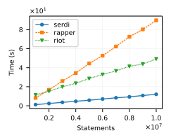
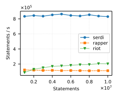
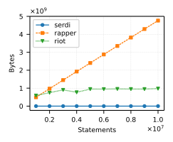

<!-- Copyright 2011-2022 David Robillard <d@drobilla.net> -->
<!-- SPDX-License-Identifier: ISC -->

Serd
====

Serd is a lightweight C library for working with RDF data.

Serd can be used by high-performance or resource-limited applications to read
or write [Turtle][], [TriG][], [NTriples][], and [NQuads][].  The included
`serdi` tool can be used to efficiently process RDF documents in scripts or on
the command-line.

Features
--------

 * **Free:** Serd is [Free Software][] released under the extremely liberal
   [ISC license][].

 * **Portable and Dependency-Free:** Serd has no external dependencies other
   than the C standard library.  It is known to compile with Clang, GCC, and
   MSVC, and is tested on GNU/Linux, FreeBSD, MacOS, and Windows.

 * **Small:** Serd is implemented in a few thousand lines of C.  When optimized,
   it compiles to well under 100 KiB.

 * **Fast and Lightweight:** Serd can stream abbreviated Turtle, unlike many
   tools which must first build an internal model.  This makes it particularly
   useful for writing very large data sets, since it can do so using only a
   small amount of memory.  Serd is, to the author's knowledge, the fastest
   Turtle reader/writer by a wide margin (see [Performance](#performance)
   below).

 * **Conformant and Well-Tested:** Serd passes all tests in the Turtle and TriG
   test suites, correctly handles all "normal" examples in the URI
   specification, and includes many additional tests which were written
   manually or discovered with fuzz testing.  The test suite is run
   continuously on many platforms, has 100% code coverage by line, and runs
   with zero memory errors or leaks.  Code quality is continuously checked
   statically by [clang-tidy][], and dynamically by various clang sanitizers.

Performance
-----------

The benchmarks below compare `serdi`, [rapper][], and [riot][] re-serialising
Turtle data generated by [sp2b][] on an AMD 1950x.  Of the three, `serdi` is
the fastest by a wide margin, and the only one that uses a constant amount of
memory for all input sizes.

Documentation
-------------

 * [Installation instructions](INSTALL.md)
 * [Single-page API reference](https://drobilla.gitlab.io/serd/c/singlehtml)
 * [Paginated API reference](https://drobilla.gitlab.io/serd/c/html)
 * [`serdi` man page](https://drobilla.gitlab.io/serd/man/serdi.html)

Versioning
----------

Serd uses strict [semantic versioning](http://semver.org/), which reflects the
ABI of the C library.  The shared library name, include directory, and
pkg-config file are all suffixed with the major version number to allow for
parallel installation of several major versions (which distribution packages
should preserve).  To build against serd, use the pkg-config package `serd-0`:

    pkg-config --cflags --libs serd-0

 -- David Robillard <d@drobilla.net>

[Turtle]: https://www.w3.org/TR/turtle/
[TriG]: https://www.w3.org/TR/trig/
[NTriples]: https://www.w3.org/TR/n-triples/
[NQuads]: https://www.w3.org/TR/n-quads/
[Free Software]: http://www.gnu.org/philosophy/free-sw.html
[ISC license]: http://opensource.org/licenses/isc
[clang-tidy]: https://clang.llvm.org/extra/clang-tidy/
[rapper]: http://librdf.org/raptor/
[riot]: https://jena.apache.org/
[sp2b]: http://www2.informatik.uni-freiburg.de/~mschmidt/docs/sp2b.pdf
