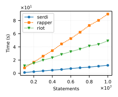
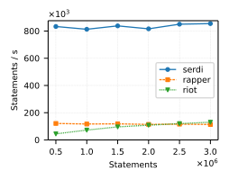
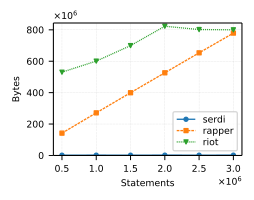

Serd
====

Serd is a lightweight C library for working with RDF data in [Turtle][],
[NTriples][], [NQuads][], and [TriG][] formats.  It is particularly suitable
for performance-critical or resource-limited applications, such as rewriting
very large data sets, or working on restricted platforms.

Features
--------

 * **Free:** Serd is [Free Software][] released under the extremely liberal
   [ISC license][].

 * **Portable and Dependency-Free:** Serd has no external dependencies other
   than the C standard library.  It is known to compile with GCC, Clang, and
   MSVC (as C++), and is tested on GNU/Linux, MacOS, and Windows.

 * **Small:** Serd is implemented in a few thousand lines of C.  It typically
   compiles to about 100 KiB, or about 50 KiB stripped with size optimizations.

 * **Fast and Lightweight:** Serd can stream abbreviated Turtle, unlike many
   tools which must first build an internal model.  This makes it particularly
   useful for writing very large data sets, since it can do so using only a
   small amount of memory.  Serd is, to the author's knowledge, the fastest
   Turtle reader/writer by a wide margin (see [Performance](#performance)
   below).

 * **Conformant and Well-Tested:** Serd passes all tests in the Turtle and TriG
   test suites, correctly handles all "normal" examples in the URI
   specification, and includes many additional tests which were written
   manually or discovered with fuzz testing.  The test suite is run
   continuously on many platforms, has 100% code coverage by line, and runs
   with zero memory errors or leaks.

Performance
-----------

The benchmarks below compare `serd-pipe`, [rapper][], and [riot][] rewriting
Turtle data generated by [sp2b][] on an i7-4980HQ running Debian 9.  Of the
three, `serd-pipe` is the fastest by a wide margin, and the only one that uses
a constant amount of memory (a single page) for all input sizes.

Documentation
-------------

 * Overview and reference documentation:
   * [Paginated HTML](https://drobilla.gitlab.io/serd/c/html)
   * [Single page HTML](https://drobilla.gitlab.io/serd/c/singlehtml)
   * [EPUB](https://drobilla.gitlab.io/serd/c/epub/Serd-1.0.1.epub)
 * Man pages:
   * [`serd-filter`](https://drobilla.gitlab.io/serd/man/serd-filter.html)
   * [`serd-pipe`](https://drobilla.gitlab.io/serd/man/serd-pipe.html)
   * [`serd-sort`](https://drobilla.gitlab.io/serd/man/serd-sort.html)
   * [`serd-validate`](https://drobilla.gitlab.io/serd/man/serd-validate.html)

 -- David Robillard <d@drobilla.net>

[Turtle]: https://www.w3.org/TR/turtle/
[TriG]: https://www.w3.org/TR/trig/
[NTriples]: https://www.w3.org/TR/n-triples/
[NQuads]: https://www.w3.org/TR/n-quads/
[Free Software]: http://www.gnu.org/philosophy/free-sw.html
[ISC license]: http://opensource.org/licenses/isc
[rapper]: http://librdf.org/raptor/
[riot]: https://jena.apache.org/
[sp2b]: http://www2.informatik.uni-freiburg.de/~mschmidt/docs/sp2b.pdf
